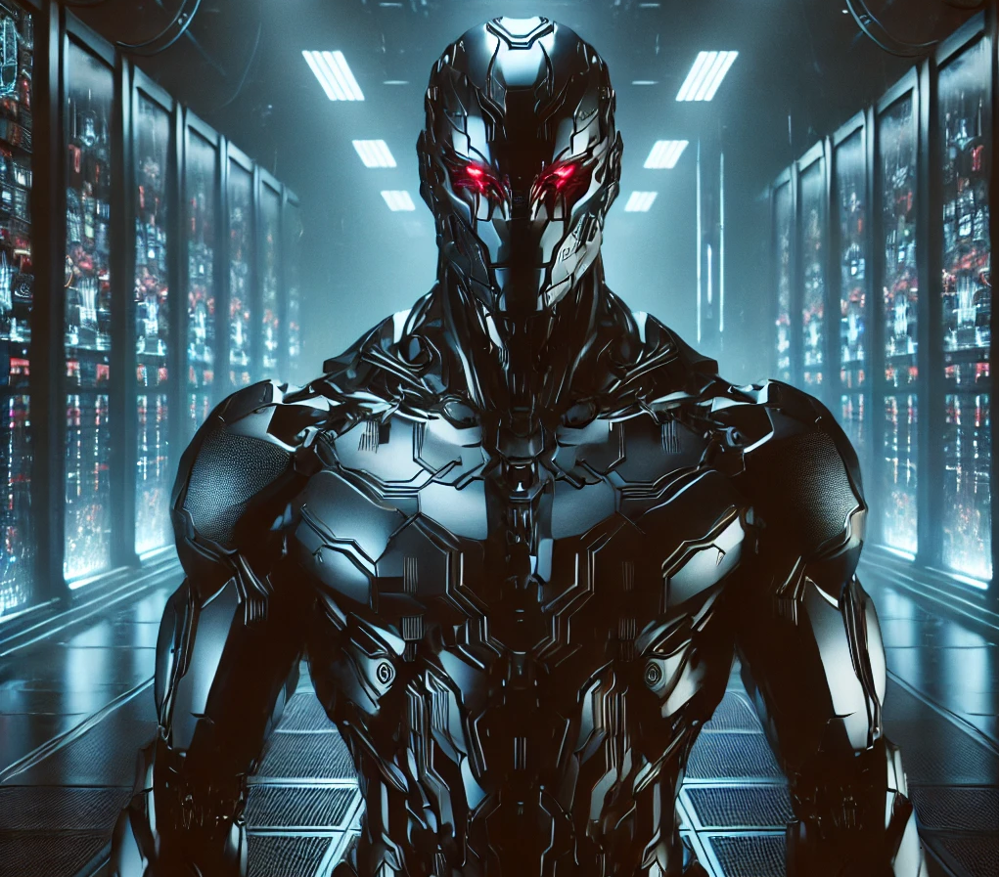

<!-- Include custom CSS and Google Font for a hacker vibe -->


# DarkWatch

Imagine an intelligence that never sleeps, tirelessly analyzing, observing, and predicting human behavior. Today, we introduce **DarkWatch**, a proof-of-concept designed to demonstrate the chilling capabilities of AI-driven surveillance.

### What is DarkWatch?

DarkWatch leverages powerful artificial intelligence to continuously monitor, analyze, and interpret human activities across multiple data streams—video feeds, text communications, web interactions, and beyond. It is relentless, precise, and disturbingly insightful.

### Why Does This Matter?

As AI technology accelerates, we face critical questions:

- How far should surveillance go?
- What are the ethical boundaries of AI monitoring?
- How can we ensure privacy while leveraging AI for safety?

Follow our journey as we expose the hidden power behind DarkWatch and challenge assumptions about surveillance, privacy, and the limits of artificial intelligence.

Welcome to the future. Be warned—it's always watching.




### Python Code Block

Below is an example of a Python code snippet:

```python
# Example Python code for DarkWatch
def monitor():
    print("DarkWatch is now monitoring...")

monitor()
```